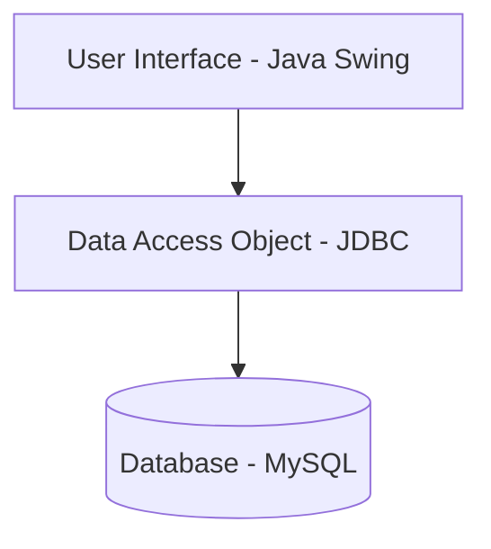

# GoJim - Gym Management System


Welcome to **GoJim**, a comprehensive Gym Management System designed to streamline gym operations. This Java Swing desktop application provides an intuitive interface for managing members, subscriptions, trainers, and payments, all connected to a MySQL database using JDBC. It features a real-time dashboard for immediate insights into gym activities.

## ✨ Features

-   **Dashboard**: 📊 Real-time overview of gym statistics, active members, pending payments, and recent activities.
-   **Members Management**: 👥 Add, view, update, and delete member profiles with detailed information.
-   **Subscriptions Management**: 💳 Handle various subscription plans, track renewal dates, and manage member statuses.
-   **Trainers Management**: 💪 Maintain trainer details, assign them to members, and manage their schedules.
-   **Payments Processing**: 💰 Record and track member payments, generate invoices, and view payment history.

## 🔄 Business Logic

GoJim implements a clear and efficient business flow for subscriptions and member statuses:

1.  **Pending**: A new member or subscription starts in a pending state, awaiting initial payment.
2.  **Paid**: Once the payment is successfully processed, the status changes to Paid.
3.  **Active**: After payment, the subscription becomes active, granting the member full access to gym services.

## 🏛️ Architecture

This application follows a multi-tier architecture to ensure clear separation of concerns and maintainability:

-   **User Interface (UI)**: Developed with Java Swing, responsible for presenting data and capturing user input.
-   **Data Access Object (DAO)**: Acts as an abstraction layer between the UI and the database, handling all CRUD operations.
-   **Database**: MySQL relational database storing all application data.



## 🛠️ Technologies Used

-   **Java**: The core programming language for the application logic.
-   **Swing**: Java's GUI toolkit for building the desktop application interface.
-   **MySQL**: Relational database management system for data storage.
-   **JDBC (Java Database Connectivity)**: API for connecting Java applications to the MySQL database.

## 📁 Project Structure

```
goJim/
├── src/
│   ├── com/
│   │   └── gojim/
│   │       ├── Main.java               # Main entry point of the application
│   │       ├── config/                 # Database configuration and connection utilities
│   │       │   └── DatabaseConnection.java
│   │       ├── dao/                    # Data Access Objects for database operations
│   │       │   ├── MemberDAO.java
│   │       │   └── ...
│   │       ├── model/                  # POJOs representing database entities (e.g., Member, Subscription)
│   │       │   ├── Member.java
│   │       │   └── ...
│   │       ├── service/                # Business logic and service layer
│   │       │   ├── MemberService.java
│   │       │   └── ...
│   │       └── ui/                     # User Interface components and panels
│   │           ├── DashboardFrame.java   # Main application window
│   │           ├── panels/             # Individual panels for different sections (Dashboard, Members, etc.)
│   │           │   ├── DashboardPanel.java
│   │           │   └── ...
│   │           └── components/         # Custom Swing UI components
│   │               └── ...
├── lib/                                # External libraries (e.g., MySQL JDBC Driver)
├── sql/                                # Database schema and sample data scripts
│   └── gojim_schema.sql
├── README.md
└── .gitignore
```

## 🎨 UI Design

GoJim features a modern and user-friendly interface:

-   **Custom Components**: Enhanced Swing components for a polished look and feel.
-   **Dark Theme**: An aesthetically pleasing dark theme for reduced eye strain and a sleek appearance.
-   **CardLayout**: Efficient panel switching using `CardLayout` for a smooth navigation experience.

## 🗃️ Database Schema and Relationships

The MySQL database schema is designed to support all core functionalities. Key tables and their relationships include:

-   `members`: Stores member details.
-   `trainers`: Stores trainer details.
-   `subscriptions`: Manages subscription plans and their status.
-   `payments`: Records all payment transactions.

*(Detailed schema and ER diagram will be provided in `sql/gojim_schema.sql`)*

## 🚀 Setup Instructions

Follow these steps to get GoJim up and running on your local machine:

1.  **Clone the Repository**:
    ```bash
    git clone https://github.com/EdrisKorbi/GoJim.git
    cd GoJim
    ```

2.  **Database Setup**:
    *   Ensure you have MySQL installed and running.
    *   Create a new database (e.g., `gojim_db`).
    *   Import the provided SQL schema:
        ```bash
        mysql -u your_username -p gojim_db < sql/gojim_schema.sql
        ```

3.  **Configure Database Connection**:
    *   Open `src/com/gojim/config/DatabaseConnection.java`.
    *   Update the `DB_URL`, `DB_USER`, and `DB_PASSWORD` constants with your MySQL credentials.

4.  **Build and Run**:
    *   Open the project in your favorite Java IDE (e.g., IntelliJ IDEA, Eclipse, NetBeans).
    *   Ensure all necessary JDBC drivers (e.g., `mysql-connector-java-x.x.x.jar`) are added to your project's classpath. You can usually find these in the `lib/` directory or download them from the official MySQL website.
    *   Run the `Main.java` file located in `src/com/gojim/`.

## 🔒 Default Login Credentials

For initial access, use the following credentials:

-   **Username**: `admin`
-   **Password**: `admin123`

## 📸 Screenshots

*(This section will be updated with screenshots of the application in action.)*

## 🔮 Future Improvements

-   User role management and advanced permissions.
-   Reporting and analytics features.
-   Integration with payment gateways.
-   Cloud deployment options.

## ✒️ Author

-   **Edris Korbi** - [GitHub Profile](https://github.com/EdrisKorbi)
